# آکادمی‌منیجر پرو (Academy Manager Pro)

## مدیریت کامل آموزشگاه — از ثبت‌نام تا حسابداری، در یک نرم‌افزار

**نسخه ۱.۰.۰ | فارسی، کاملاً راست‌به‌چپ، با تقویم شمسی**

---

## چرا این نرم‌افزار؟

اگر آموزشگاه دارید، احتمالاً همین حالا هم با همین روزهای کاری آشنا هستید: صبح با لیست حضور و غیاب شروع می‌کنید، ظهر دنبال می‌گردید کدام هنرجو قسطش عقب افتاده، شب هم هنوز با اکسل‌های به‌هم‌ریخته درگیر بدهی‌ها و درآمدی هستید که هیچ‌وقت دقیق نمی‌شود.

**آکادمی‌منیجر پرو** برای همین ساخته شده: یک نرم‌افزار که تمام کارهای روزانه آموزشگاه — ثبت‌نام، کلاس، حضور و غیاب، آزمون، شهریه، اقساط، حقوق و حتی حسابداری دوبل — را در یک پنجره جمع کرده باشد. بدون اکسل، بدون چند نرم‌افزار جدا، بدون «یادم رفته بود».

> همه تصاویر این داکیومنت، اسکرین‌شات‌های واقعی از نرم‌افزار در حال اجرا هستند؛ دقیقاً همان چیزی که روی سیستم شما اجرا می‌شود.

---

## ۱. داشبورد هوشمند: وضعیت آموزشگاه، یک نگاه

به‌محض ورود، همه‌چیز جلوی چشم شماست: تعداد هنرجویان فعال، کلاس‌های امروز، درآمد ماه، موجودی صندوق و تازه‌ترین فعالیت‌ها. تقویم شمسی و ساعت زنده در نوار بالا، و دکمه‌های دسترسی سریع برای چهار کار پرکاربردی که هر روز انجام می‌دهید: ثبت هنرجوی جدید، ثبت‌نام، دریافت وجه و تحلیل هوشمند.

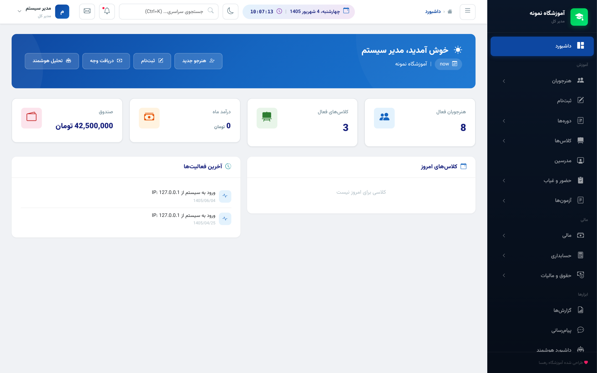

و اگر شب‌ها بیشتر کار می‌کنید، **حالت تاریک** یک کلیک است:

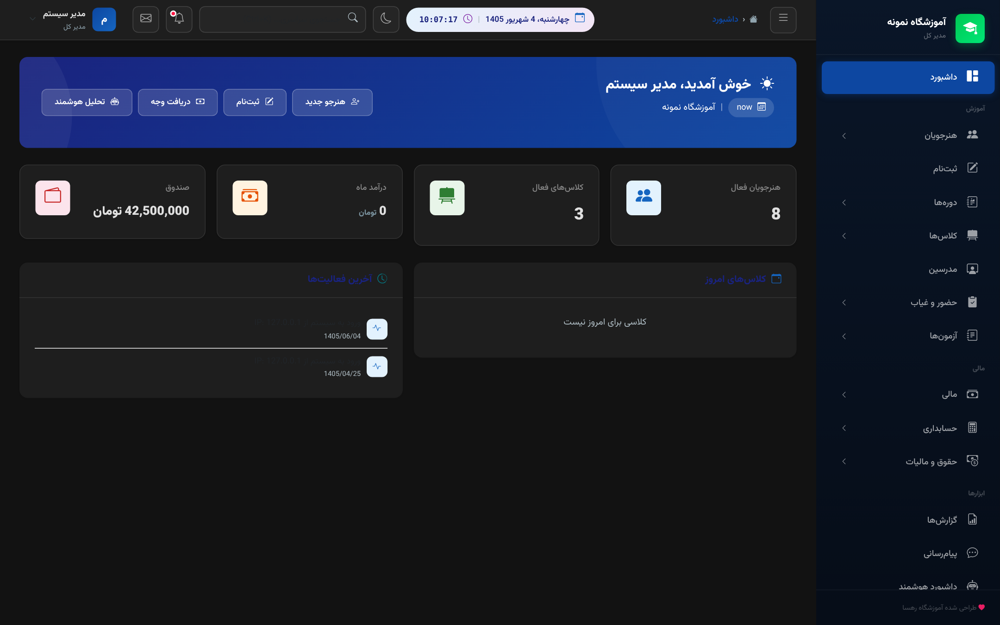

---

## ۲. مدیریت هنرجویان: پرونده‌ای کامل برای هر نفر

**لیست هنرجویان** با کدگذاری خودکار (هر هنرجو کد منحصربه‌فرد `ST-1405-XXXXX` می‌گیرد)، جستجوی آنی بر اساس نام، موبایل یا کد ملی، و فیلتر بر اساس وضعیت و دسته‌بندی (نوجوان، بزرگسال، سازمانی):

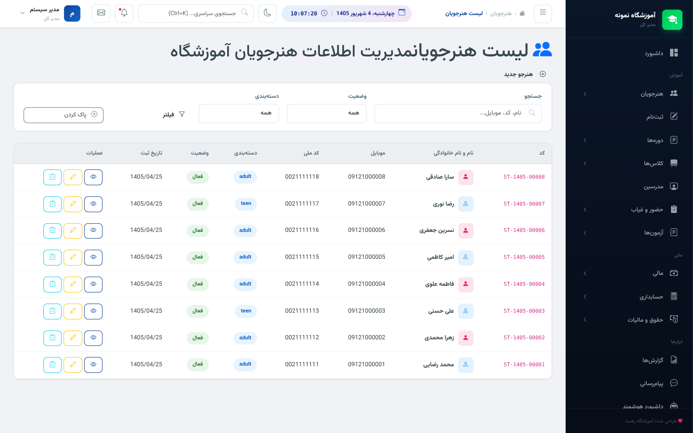

پرونده هر هنرجو یک صفحه کامل است: اطلاعات شخصی، مشخصات تماس (شامل اطلاعات والدین برای هنرجویان نوجوان)، وضعیت مالی، و **سابقه ثبت‌نام‌ها** — چه دوره‌هایی گرفته، شهریه‌اش چقدر بوده، چقدر پرداخت کرده و چقدر مانده:

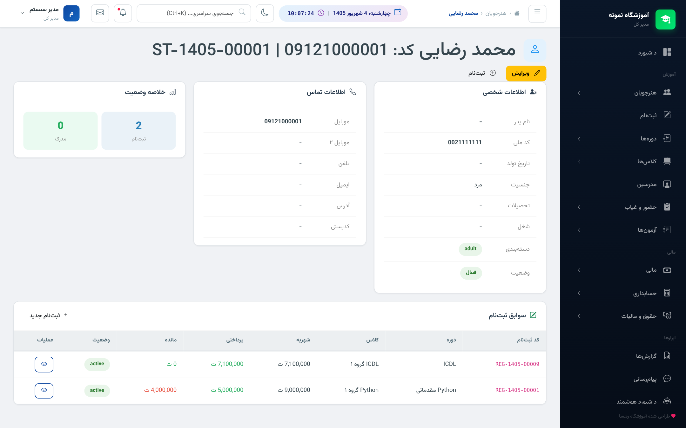

و برای روزهای مهم، **کارت شناسایی هنرجوی** با QR Code، آماده چاپ:

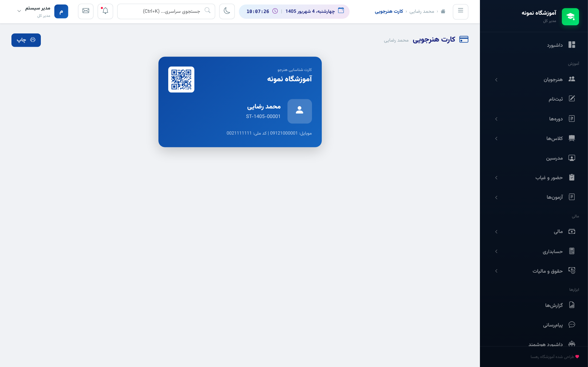

---

## ۳. ثبت‌نام: از اولین تماس تا کنترل کامل شهریه

در صفحه ثبت‌نام، همه‌چیز در یک جدول شفاف است: هر ثبت‌نام کد `REG-1405-XXXXX` دارد، دوره و کلاس مشخص است، شهریه کل و مبلغ پرداختی کنار هم دیده می‌شود — و **مانده بدهی به رنگ قرمز**، تا هیچ‌وقت گم نشود. کنترل ظرفیت کلاس‌ها هم خودکار است: جایی که جا نباشد، ثبت‌نام جدید بلاک می‌شود و هنرجو به لیست انتظار می‌رود.

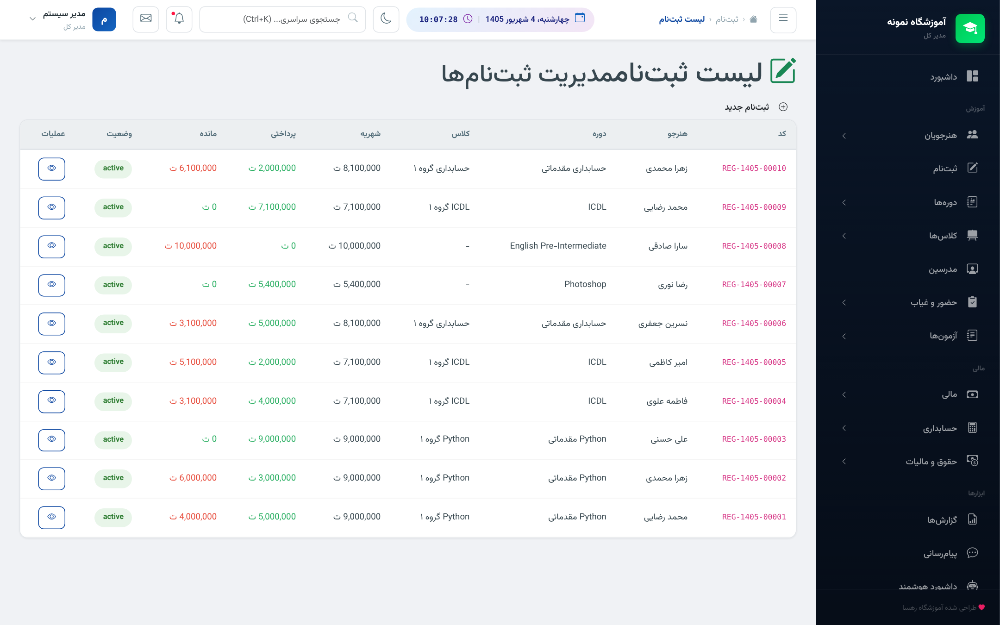

---

## ۴. کلاس‌ها و جلسات: برنامه‌ریزی بدون سردرگمی

هر کلاس با کد خودکار (`ACC-1405-01`، `ICDL-1405-01`، `PY-1405-01`) شناسایی می‌شود: دوره، مدرس، ساعت، ظرفیت و وضعیت — همه در یک نگاه.

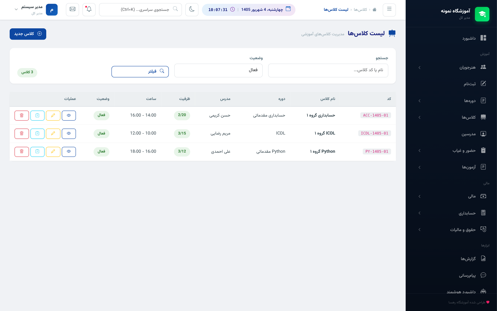

داخل هر کلاس، لیست هنرجویان و **لیست جلسات** با موضوع هر جلسه (آشنایی با Python، متغیرها، حلقه‌ها...) و وضعیت آن‌ها — برگزارشده یا برنامه‌ریزی‌شده — مشخص است. انتقال هنرجو بین کلاس‌ها، تولید جلسات گروهی و چاپ لیست کلاس هم همین‌جا است:

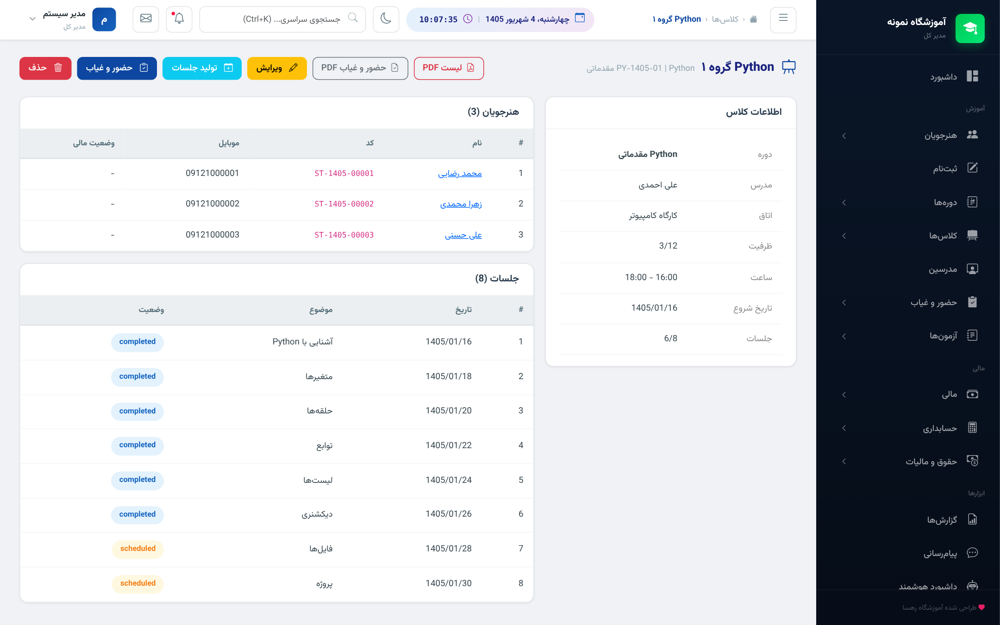

---

## ۵. حضور و غیاب: ثبت یک دقیقه‌ای، گزارش دقیق

صفحه حضور و غیاب، کلاس‌های روز را با مدرس و تعداد هنرجویان نشان می‌دهد؛ یک کلیک روی «حضور» و جلسه ثبت می‌شود. ثبت ساعت ورود و خروج، حضور و غیاب مدرس، و گزارش درصد حضور برای هر کلاس هم بخشی از همین بخش است:

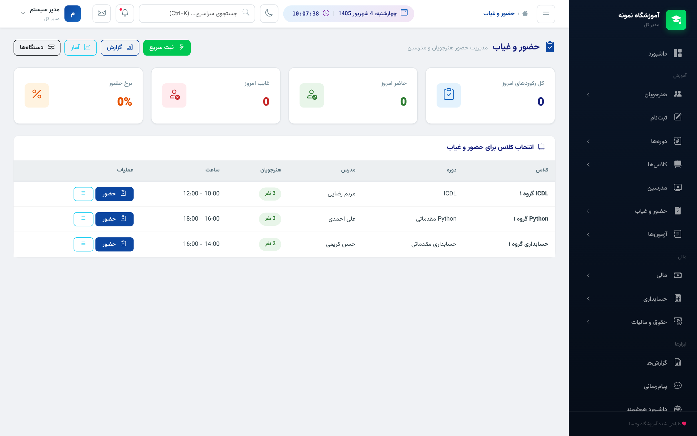

و گزارش جمع‌بندی، درصد حضور هر کلاس را با نوار پیشرفت نشان می‌دهد — مثلاً ۸۸.۹٪ برای کلاس Python:

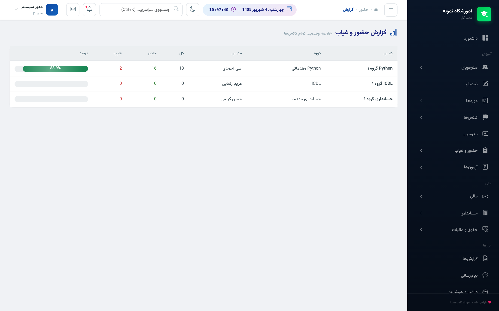

---

## ۶. آزمون و نمرات: ارزیابی ترکیبی و بدون دردسر

برای هر دوره می‌توانید آزمون تعریف کنید — کتبی، عملی، شفاهی یا آنلاین — با مدت مشخص، نمره کل و نمره قبولی. نتایج، **نمره ترکیبی** (ترکیب نمره تئوری و عملی) را خودکار محاسبه می‌کند و وضعیت قبولی/غیرقبولی را مشخص می‌سازد. ثبت نمره، تصحیح خودکار، اعتراض به نمره و تاریخچه کامل آزمون‌های هر هنرجو هم در همین بخش:

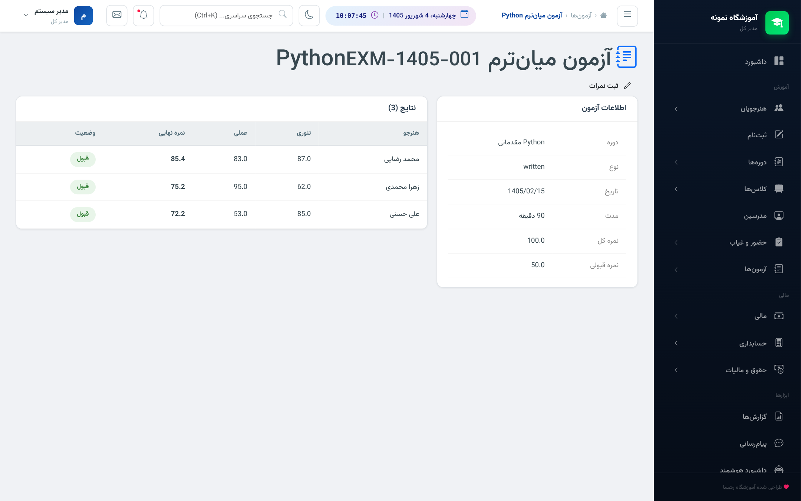

---

## ۷. مدیریت مدرسین: پرونده حرفه‌ای برای هر مدرس

برای هر مدرس، پرونده‌ای کامل: تخصص‌ها (مثلاً Python، Django)، تحصیلات، سطح تدریس، نوع قرارداد (ساعتی، ثابت، درصدی)، سابقه کار و **ارزیابی توسط هنرجویان**. کلاس‌های فعال و برنامه کاری هر مدرس هم همین‌جا قابل مشاهده است — و محاسبه حقوق بر اساس ساعات تدریس به‌صورت خودکار انجام می‌شود:

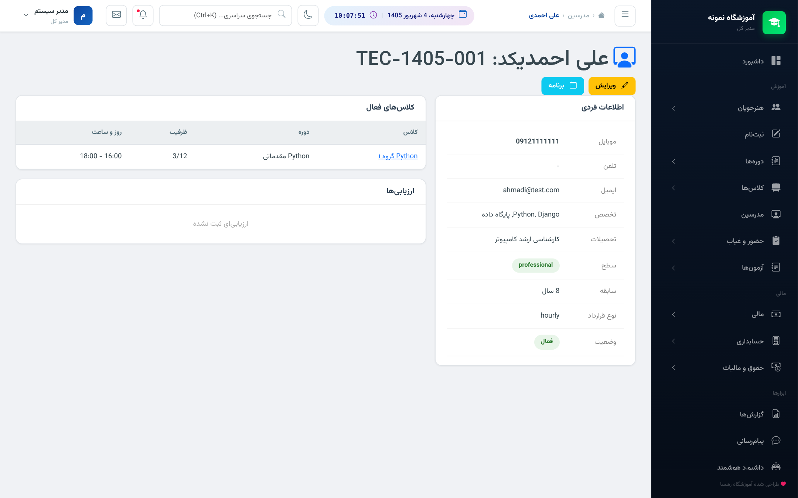

---

## ۸. مالی: جریان پول آموزشگاه، شفاف و زنده

داشبورد مالی، وضعیت جریان نقد را یک‌جای نشان می‌دهد: درآمد ماه، هزینه ماه، سود، موجودی صندوق — و دو لیستی که مدیر هر روز به آن‌ها نیاز دارد: **بدهکاران** (با مانده دقیق هر نفر) و **اقساط معوقه**:

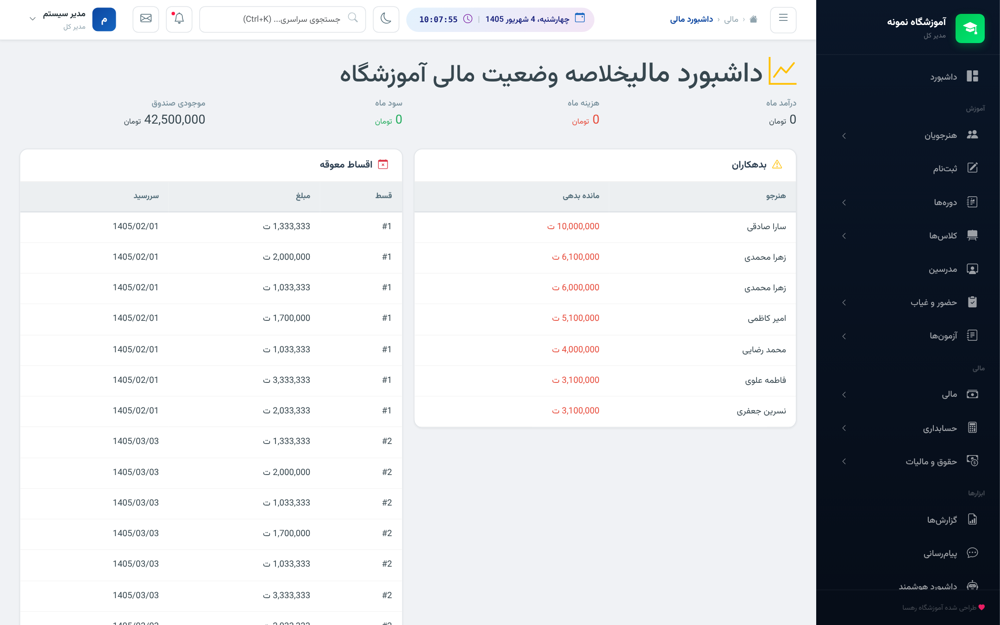

تمام پرداخت‌ها با شماره رسید خودکار (`PAY-1405-XXXXX`) ثبت می‌شوند — نقدی، کارت‌به‌کارت یا ترکیبی — و در لحظه، مانده بدهی هنرجو به‌روز می‌شود:

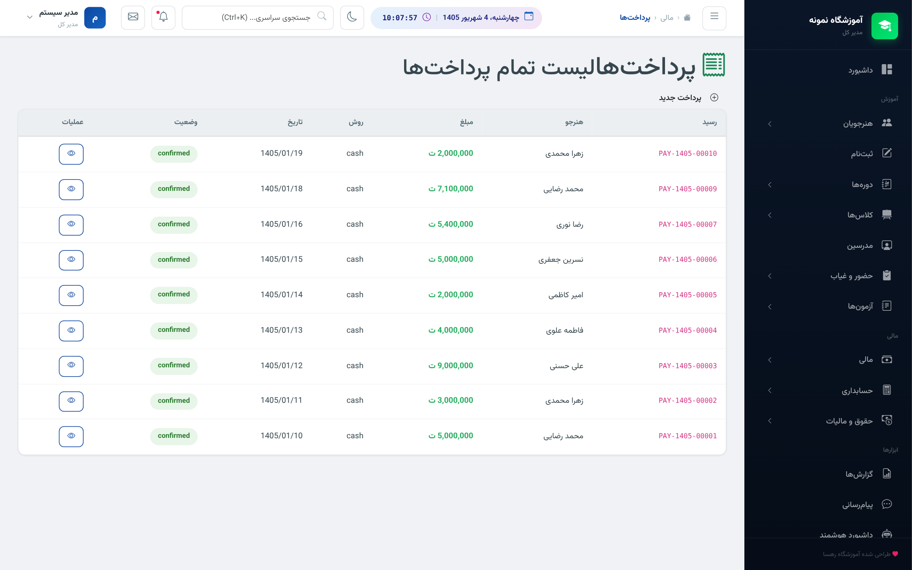

---

## ۹. سیستم اقساط: پیگیری خودکار تا آخرین تومان

وقتی شهریه کامل نقدی پرداخت نمی‌شود، نرم‌افزار **برنامه اقساطی** می‌سازد و هر قسط را با سررسید مشخص می‌کند. قسطی که دیر شود، **جریمه دیرکرد خودکار محاسبه** می‌شود (در تصویر، جریمه‌های محاسبه‌شده برای اقساط ۱۲ روز معوق) و کل بدهی معوق در بالای صفحه جمع‌بندی می‌شود. با دکمه «یادآوری گروهی» می‌توانید بدون تک‌تک زنگ زدن، به همه بدهکاران یادآوری بفرستید:

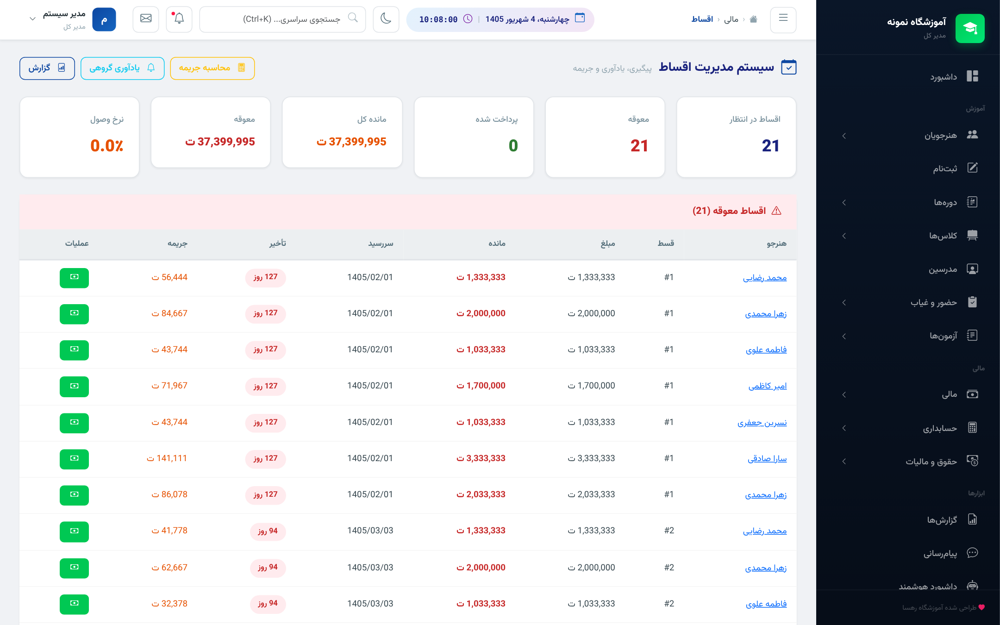

---

## ۱۰. حسابداری دوبل: چیزی که نرم‌افزارهای آموزشگاهی معمولاً ندارند

اکثر نرم‌افزارهای آموزشگاهی «مالی ساده» دارند. آکادمی‌منیجر پرو **حسابداری استاندارد دوبل** دارد: بدهکار و بستانکار، کدینگ ۴ سطحه (گروه، کل، معین، تفصیلی) و چرخه کامل سند.

**دفتر روزنامه** — هر سند با شماره خودکار (`SND-00001`)، تاریخ شمسی، نوع و وضعیت (پیش‌نویس → تایید → تأیید نهایی):

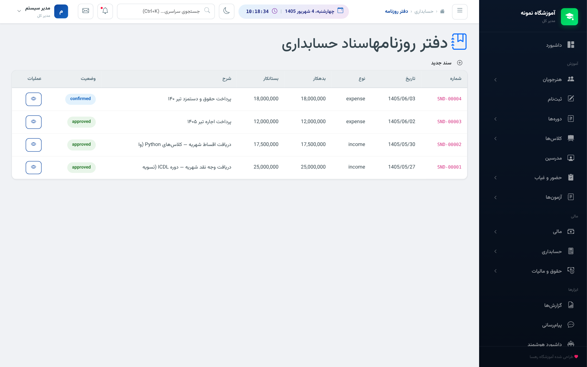

**تراز آزمایشی** — تراز بدهکار و بستانکار تمام حساب‌ها، همیشه در یک صفحه:

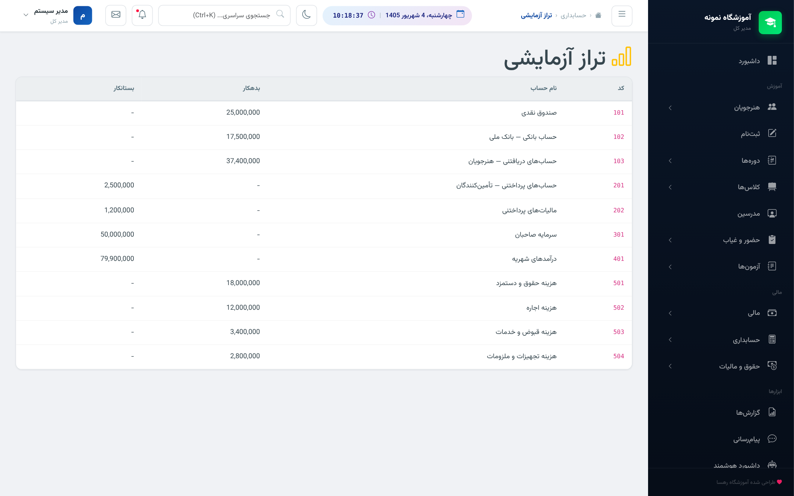

**دفتر کل حساب‌ها** — ساختار حساب‌ها به تفکیک گروه (دارایی، بدهی، سرمایه، درآمد، هزینه) با مانده زنده:

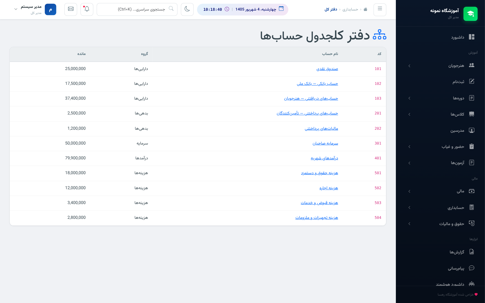

**جزئیات هر سند** — سطر به سطر، با جمع‌بندی خودکار بدهکار و بستانکار:

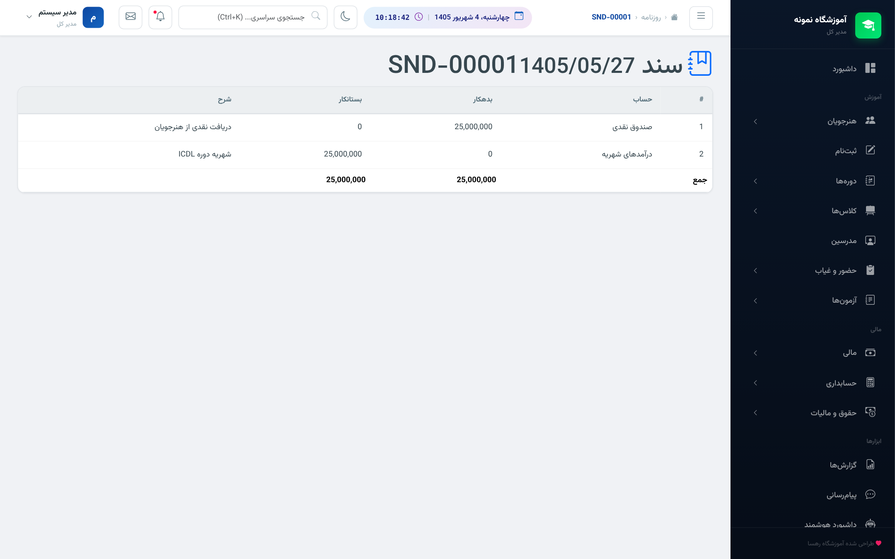

و در نهایت، **صورت سود و زیان** که درآمد و هزینه‌ها را روبروی هم می‌گذارد تا سود واقعی آموزشگاه را ببینید:

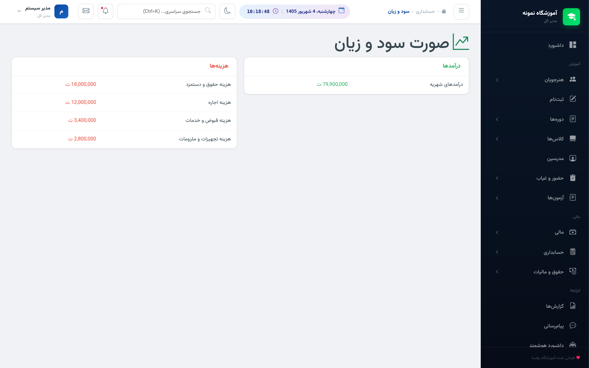

---

## ۱۱. حقوق و مالیات: فیش حقوقی و برآورد مالیات، خودکار

بخش حقوق، قراردادها را به‌دسته‌بندی ثابت/ساعتی/درصدی/جلسه‌ای مدیریت می‌کند، فیش حقوقی صادر می‌کند و کسورات (مساعده، بیمه، جریمه، مالیات) را کسر می‌کند:

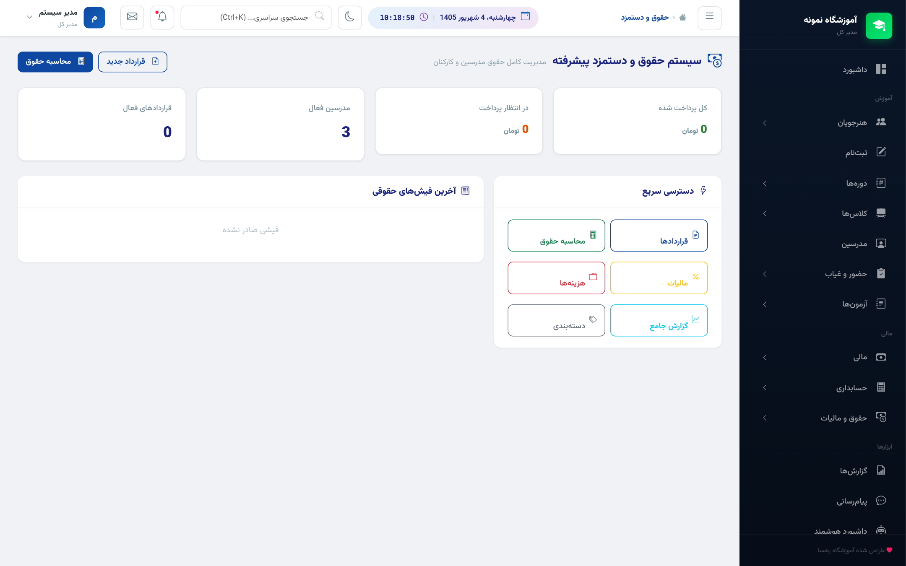

و ماژول **مالیات**، برآورد مالیاتی سالانه را بر اساس برآکت‌های رسمی (نسخه ۱۴۰۵ با نرخ‌های ۰ تا ۳۵٪) محاسبه می‌کند — تا پایان سال با شگفتی مواجه نشوید:

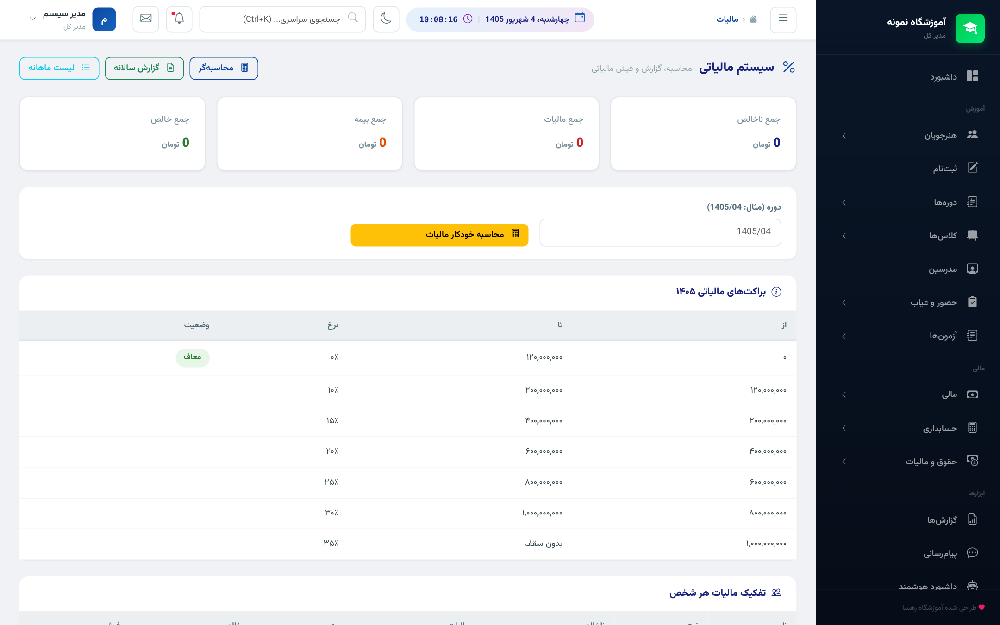

---

## ۱۲. گزارش‌ها و تحلیل هوشمند: تصمیم‌گیری بر اساس عدد، نه حدس

گزارش مالی، روند درآمد و هزینه ماه‌ها را رسم می‌کند تا الگوها را ببینید:

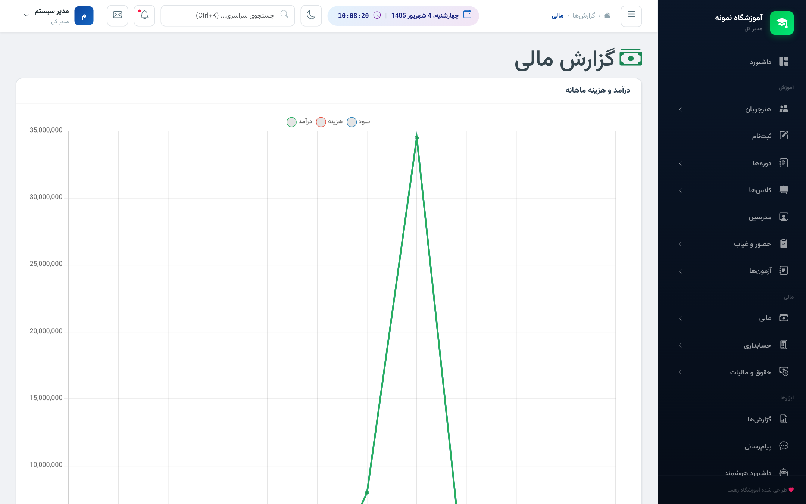

و **داشبورد تحلیل هوشمند**، سؤالاتی را جواب می‌دهد که شاید اصلاً به ذهن‌تان نرسیده بود: روند درآمد، روند ثبت‌نام، محبوب‌ترین دوره‌ها، منابع معرفی (هنرجو از کجا آمده؟) — و بخش‌هایی مثل تحلیل ریزش، پیش‌بینی ثبت‌نام و شناسایی بدهکاران پرریسک:

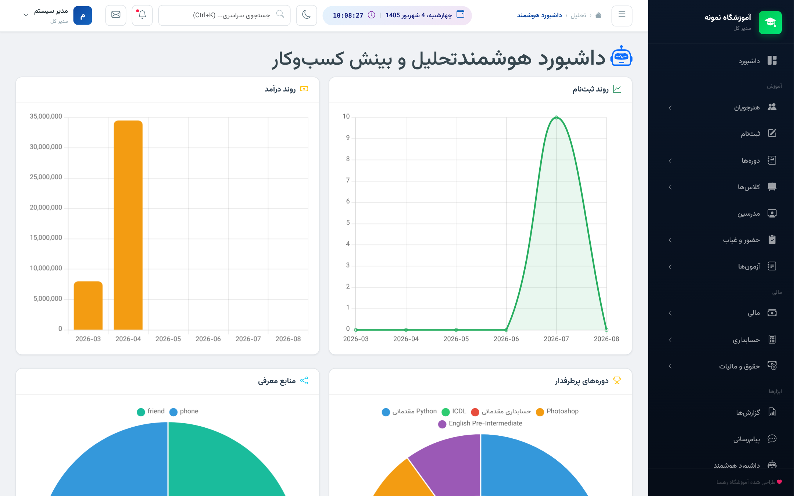

---

## ۱۳. ارتباط با هنرجویان: پیامک و ربات تلگرام/بله

پیامک تکی یا **گروهی** — مثلاً یادآوری قسط برای یک کلاس خاص یا اطلاع‌رسانی برای همه هنرجویان — با قالب‌های آماده:

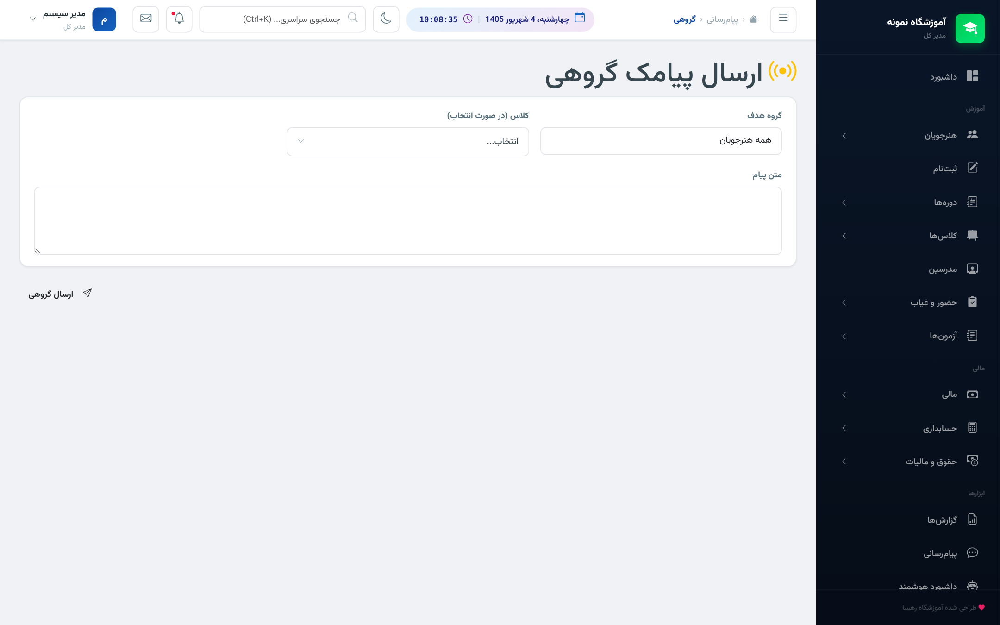

و **پنل ربات تلگرام و بله**: مدیریت کاربرانی که با ربات شما چت کرده‌اند، ارسال پیام گروهی، طراحی کیبوردها و مشاهده گزارش فعالیت — همه از داخل همان نرم‌افزار:

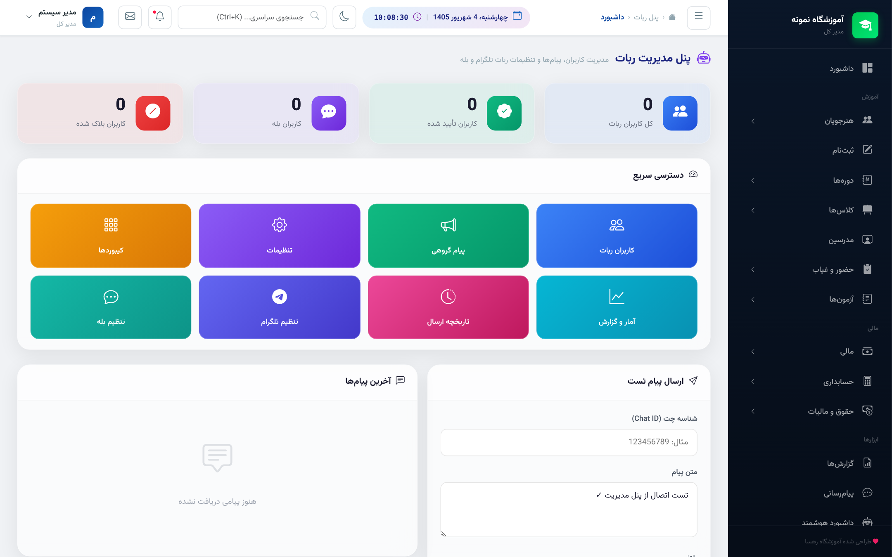

---

## ۱۴. گواهینامه: اعتبار مدرک، در یک کلیک

صدور گواهینامه با قالب رسمی یا قالب اختصاصی شما، شماره سریال و **QR Code احراز اصالت** — تا هنرجو بتواند اعتبار مدرکش را در هر لحظه راستی‌آزمایی کند:

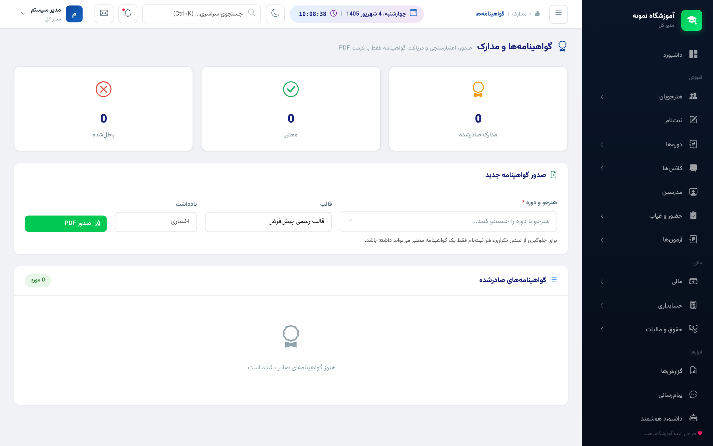

---

## ۱۵. جزئیاتی که هر روز فرق می‌سازد

**جستجوی سراسری (Ctrl+K):** هر چیزی — هنرجو، کلاس، دوره — را از هر کجای نرم‌افزار در چند ثانیه پیدا کنید:

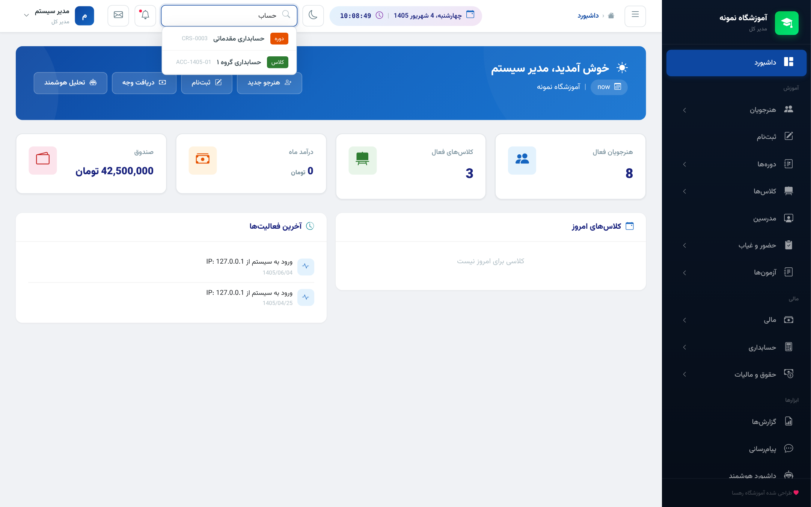

و در کنار این‌ها:

- **تقویم شمسی** در همه‌جا — تاریخ‌ها همان‌طوری که در زندگی واقعی می‌بینید
- **اعداد فارسی** در گزارش‌ها و جداول
- **حالت تاریک** برای کار در ساعات پایانی شب
- **امنیت**: ورود با رمز عبور، نقش‌محور بودن، و ثبت کامل نشست‌ها و فعالیت کاربران — هر ورود با IP و زمان ثبت می‌شود و در داشبورد قابل مشاهده است
- **پشتیبانی چند شعبه** و دسترسی از روی شبکه محلی

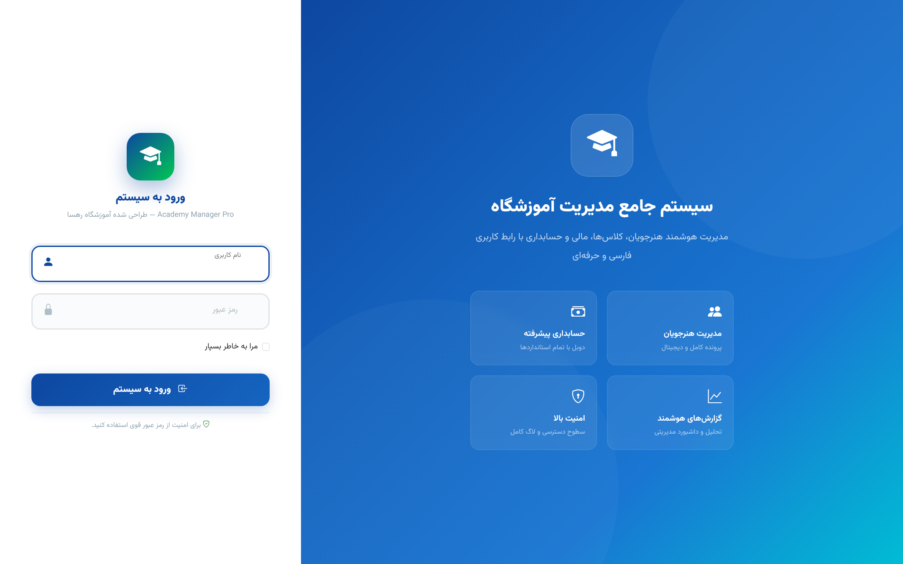

---

## ۱۶. اعداد واقعی: آمار از یک محیط زنده

تا اینجا تصاویر دیدید؛ حالا خودِ اعداد. همه‌ی رقم‌های زیر **دقیقاً در لحظه‌ی تهیه‌ی این داکیومنت از دیتابیس زنده‌ی نرم‌افزار استخراج** شده‌اند — در آموزشگاه شما، همین آمار‌ها با داده‌های خودتان زنده جابه‌جا می‌شوند.

**نمای کلی**

| مورد | مقدار |
|---|---|
| هنرجویان فعال | ۸ نفر (۶ بزرگسال، ۲ نوجوان) |
| تیم آموزشی | ۳ مدرس |
| دوره‌های فعال | ۵ دوره |
| کلاس‌های فعال | ۳ کلاس |
| جلسات برگزارشده | ۸ جلسه |
| ثبت‌نام‌های فعال | ۱۰ ثبت‌نام |
| دریافتی کل (۹ رسید) | ۴۲,۵۰۰,۰۰۰ تومان |
| اسناد حسابداری ثبت‌شده | ۴ سند |

**کلاس‌ها و ظرفیت**

| کلاس | مدرس | ثبت‌نام‌شده | نرخ اشغال |
|---|---|---|---|
| Python گروه ۱ | علی احمدی | ۳ از ۱۲ | ۲۵٪ |
| ICDL گروه ۱ | مریم رضایی | ۳ از ۱۵ | ۲۰٪ |
| حسابداری گروه ۱ | حسن کریمی | ۲ از ۲۰ | ۱۰٪ |
| جمع صندلی‌ها | — | ۸ از ۴۷ | ۱۷٪ |

**جریان مالی (سال مالی ۱۴۰)**

| مورد | مبلغ (تومان) |
|---|---|
| دریافتی اردیبهشت (۲ رسید) | ۸,۰۰۰,۰۰۰ |
| دریافتی خرداد (۷ رسید) | ۳۴,۵۰۰,۰۰۰ |
| مجموع دریافتی سال | ۴۲,۵۰۰,۰۰۰ |
| هزینه‌های ثبت‌شده | ۰ |
| سود خالص تا این لحظه | ۴۲,۵۰۰,۰۰۰ |
| موجودی فعلی صندوق | ۴۲,۵۰۰,۰۰۰ |
| اقساط پیش‌رو (۲۱ قسط) | ۳۷,۳۹۹,۹۹۵ |

**کیفیت آموزشی**

| مورد | مقدار |
|---|---|
| درصد حضور کلاس Python (۸ جلسه) | ۸۸.۹٪ (۱۶ از ۱۸) |
| آزمون‌های برگزارشده | ۱ آزمون |
| درصد قبولی | ۱۰۰٪ (۳ از ۳) |
| میانگین نمره کل | ۷۷.۶ |

> هیچ‌کدام از این اعداد ساختگی نیست — همین حالا از دیتابیس دیتای زنده‌ی محیط دمو خوانده شده‌اند و با هر تراکنش جدید شما به‌روز می‌شوند.

## مزایای رقابتی — چرا آکادمی‌منیجر پرو؟

| موضوع | راهکار معمولی | آکادمی‌منیجر پرو |
|---|---|---|
| نرم‌افزارها | ۴-۵ برنامه جدا + اکسل | یک نرم‌افزار برای همه‌چیز |
| حسابداری | ندارد یا فقط «درآمد/هزینه ساده» | حسابداری دوبل استاندارد با کدینگ ۴ سطحه |
| تقویم میلادی/فارسی | معمولاً میلادی | تقویم شمسی و اعداد فارسی در سراسر برنامه |
| اقساط و جریمه | دستی و در اکسل | خودکار، با محاسبه جریمه دیرکرد |
| مالیات | حساب دستی | برآورد خودکار با برآکت‌های رسمی |
| ارتباط | زنگ تک‌تک | پیامک گروهی + ربات تلگرام/بله |
| گزارش‌گیری | خروجی اکسل | داشبوردهای زنده و نمودار |
| هزینه سالانه | مجموع لایسنس چند نرم‌افزار | یک لایسنس، یک پشتیبان |

**در عمل یعنی:**
- **حداقل ۳-۴ ساعت در روز** کمتر در کارهای اداری و پیگیری‌ها بگذرانید
- **هیچ بدهی‌ای** دیگر در اکسل گم نمی‌شود — مانده هر هنرجو همیشه دقیق است
- **نقدینگی قابل پیش‌بینی** — با اقساط معوقه و جریمه‌های خودکار، پول‌تان زودتر برمی‌گردد
- **تصمیم‌گیری بر اساس عدد** — کدام دوره پول‌سازتر است، هنرجو از کجا می‌آید، کجا ریزش داریم
- **حرفه‌ای‌تر در چشم هنرجو** — کارت QR، گواهینامه با احراز اصالت، پیامک‌های منظم

---

## مشخصات فنی

- **سیستم‌عامل:** ویندوز (نصب‌کننده آماده + نسخه پرتابل)
- **فنی:** Python / Flask — سبک، سریع و قابل اطمینان
- **پایگاه‌داده:** SQLite (پیش‌فرض، بدون نیاز به سرور) با قابلیت اتصال به MySQL و PostgreSQL برای داده‌های حجیم
- **دسترسی شبکه:** قابل اجرا روی شبکه محلی — همه میزها به یک سرور مرکزی وصل می‌شوند
- **پشتیبان‌گیری:** از تنظیمات، هر زمان که بخواهید (با زمان‌بندی خودکار)
- **امکانات:** حالت تاریک، جستجوی سراسری، تقویم شمسی، اعداد فارسی، چند کاربر همزمان با نقش‌های مختلف

---

## ۱۹. پرسش‌های پرتکرار

**هزینه‌ی نرم‌افزار چقدر است؟**
اشتراک ماهانه‌ی پیچیده‌ای وجود ندارد؛ نرم‌افزار با **یک لایسنس واحد** صادر می‌شود. مبلغ دقیق، در جلسه‌ی دمو ۳۰ دقیقه‌ای (رایگان) بر اساس تعداد شعب و نیاز شما اعلام می‌شود.

**آیا باید کارمندانم را آموزش بدهم؟**
خیر — رابط کاربری کاملاً فارسی است و کارهای روزانه (حضور و غیاب، ثبت‌نام، دریافت وجه) در یک یا دو کلیک انجام می‌شود. در اولین جلسه‌ی رایگان، سیستم را با داده‌های خودتان راه‌اندازی و به‌صورت عملی راهنمایی می‌کنیم.

**داده‌های من امن است؟**
بله. داده‌ها روی شبکه‌ی محلی خودتان ذخیره می‌شوند (نیازی به ارسال به سرورهای شخص ثالث نیست)، پشتیبان‌گیری خودکار و زمان‌بندی‌شده دارید، چند کاربر با نقش و مجوزهای جداگانه می‌توانند کار کنند و هر ورود با IP و زمان کامل لاگ می‌شود.

**حالا که اکسل یا نرم‌افزار دیگری استفاده می‌کنم، مهاجرت داده‌ها چطور است؟**
داده‌های موجود شما — هنرجویان، شهریه‌ها و وضعیت مالی — در اولین جلسه توسط تیم ما وارد نرم‌افزار می‌شود تا بدون گم شدن حتی یک عدد، جابه‌جا شوید.

## آماده‌اید؟

**آکادمی‌منیجر پرو** را روی سیستم خودتان اجرا کنید، با داده‌های خودتان آزمایشش کنید و ببینید چند ساعت از روزتان آزاد می‌شود.

- تلفن: [شماره تماس شما]
- ایمیل: [ایمیل شما]
- وب‌سایت: [آدرس وب‌سایت]

> **یک جلسه دمو ۳۰ دقیقه‌ای رزرو کنید** — با داده‌های آموزشگاه شما.
> اولین جلسه مشاوره رایگان است.

---

*این داکیومنت با اسکرین‌شات‌های واقعی از نسخه ۱.۰.۰ تهیه شده است.*
